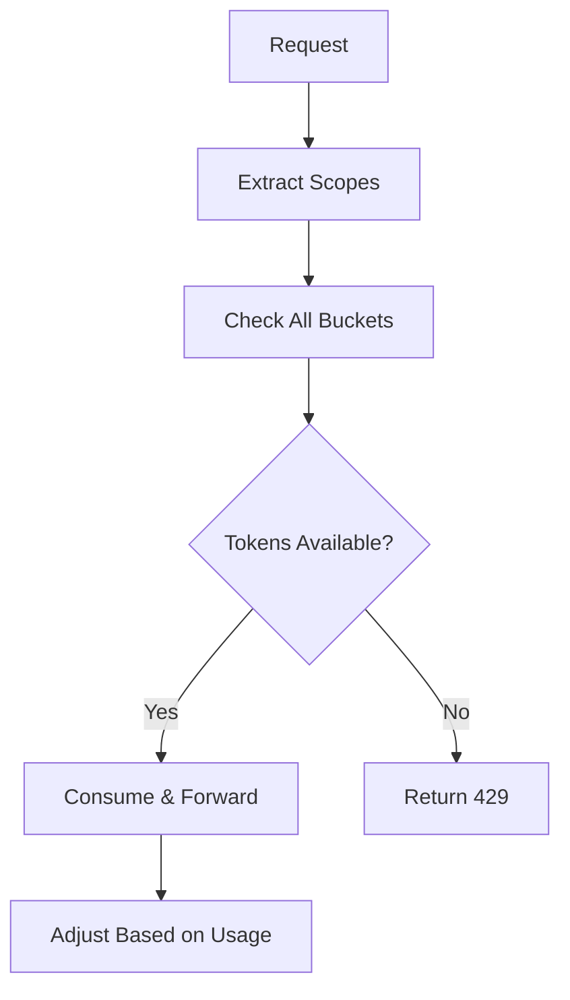

# TokenGuard

FastAPI rate limiter for LLM APIs with hierarchical token buckets.

## Features

- Hierarchical rate limiting: global → team → rolegroup → role → user
- Atomic multi-scope operations 
- OpenAI proxy with auto-sync
- Redis or in-memory backend
- REST API for budget management

## Algorithm



## Quick Start

```bash
# With Poetry
git clone <repo>
cd llmroute
cp .env.example .env  # Add OPENAI_API_KEY
poetry install --with test
poetry run app-serve

# With Docker
docker compose up --build
```

## Usage

Configure budgets:
```bash
# Set team limit
curl -X POST localhost:8000/config/budget \
  -d '{"scope":"team","id":"data-science","capacity":5000,"refillPerSec":25}'

# Set user limit  
curl -X POST localhost:8000/config/budget \
  -d '{"scope":"user","id":"alice","capacity":1000,"refillPerSec":5}'
```

Make requests:
```bash
curl -X POST localhost:8000/v1/chat/completions \
  -H 'x-user-id: alice' \
  -H 'x-team-id: data-science' \
  -d '{"messages":[{"role":"user","content":"Hello"}],"model":"gpt-4o-mini"}'
```

## Testing

```bash
pytest                    # All tests
pytest -m unit           # Unit tests only  
pytest -m integration    # Integration tests
pytest tests/unit/       # By directory
```

Test structure:
- `tests/unit/` - Fast isolated tests
- `tests/integration/` - Redis/OpenAI tests  
- `tests/e2e/` - API behavior tests

## Configuration

Environment variables:
```bash
OPENAI_API_KEY=sk-your-key
REDIS_URL=redis://localhost:6379  # Optional, uses memory if not set

# Default capacities
CAP_GLOBAL=10000
CAP_TEAM=5000  
CAP_USER=1000

# Default refill rates  
RATE_GLOBAL=50
RATE_TEAM=25
RATE_USER=5
```

Headers:
- `x-user-id` - User identifier (required)
- `x-team-id` - Team identifier  
- `x-role` - Role name
- `x-llm-rolegroup` - Role group (exact match)

## API

**POST** `/v1/chat/completions` - OpenAI-compatible endpoint with rate limiting
**POST** `/config/budget` - Configure token budgets  
**GET** `/sync/openai-limits` - Sync with OpenAI rate limits
**GET** `/` - Health check

## Deployment

```yaml
# docker-compose.yml
services:
  api:
    build: .
    ports: ["8000:8000"]
    environment:
      - REDIS_URL=redis://redis:6379
      - OPENAI_API_KEY=${OPENAI_API_KEY}
  redis:
    image: redis:7-alpine
```
